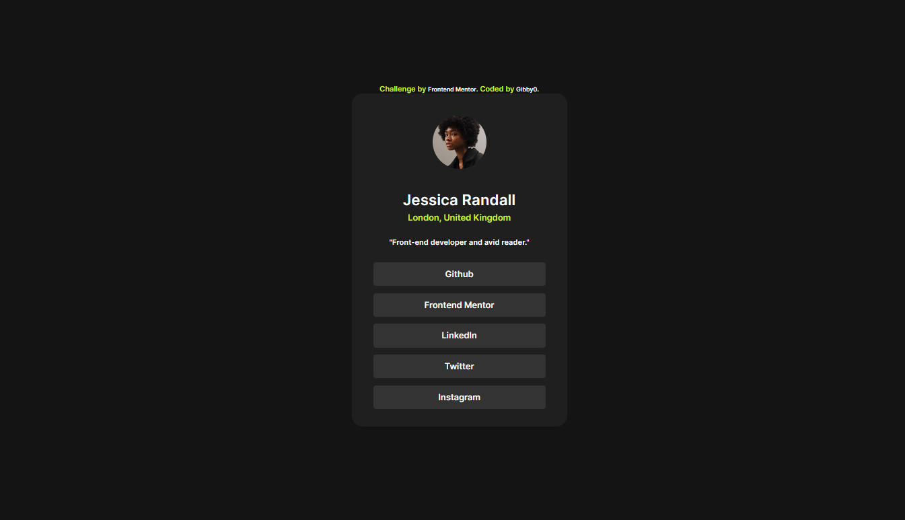

# Frontend Mentor - Social links profile solution

This is a solution to the [Social links profile challenge on Frontend Mentor](https://www.frontendmentor.io/challenges/social-links-profile-UG32l9m6dQ). Frontend Mentor challenges help you improve your coding skills by building realistic projects. 

## Table of contents

- [Overview](#overview)
  - [The challenge](#the-challenge)
  - [Screenshot](#screenshot)
  - [Links](#links)
  - [Built with](#built-with)
  - [Continued development](#continued-development)
  - [Author](#author)

## Overview
This project is a solution to the Social Links Profile Solution on Frontend Mentor.

### The challenge

Users should be able to:

- See hover and focus states for all interactive elements on the page

### Screenshot

### Links

- Solution URL: [Add solution URL here](https://your-solution-url.com)
- Live Site URL: [Add live site URL here](https://your-live-site-url.com)

### Built with

- Semantic HTML5 markup
- CSS custom properties
-Flexbox
-Google Fonts - specifically the Inter, enhancing the stylistic   delivery of the component.

### Continued development

I plan to continue focusing on improving my CSS skills, particularly in areas like responsive design and CSS grid layouts.
I plan to continue learning more about Flexbox in order to fully utilize it within my projects.

## Author
- Website - Github(https://github.com/Gibby0)
- Frontend Mentor - [@Gibby0](https://www.frontendmentor.io/profile/Gibby0)

